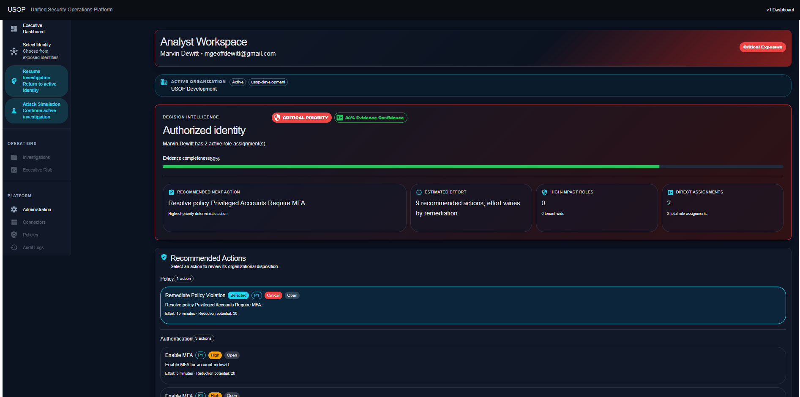
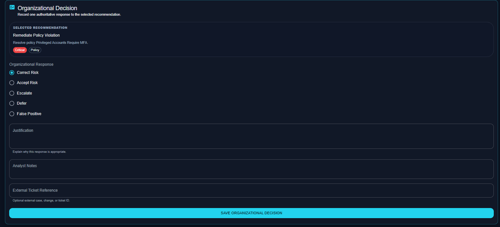
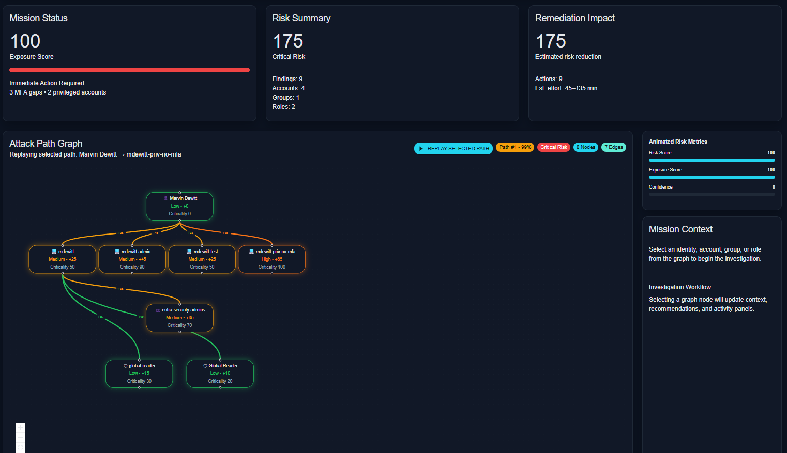
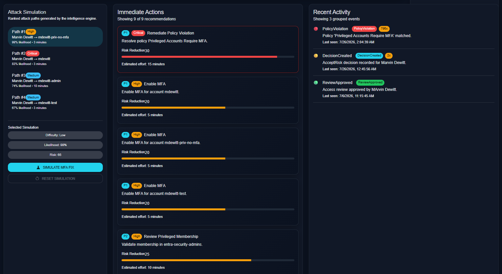

# USOP
# Unified Security Operations Platform

> **An intelligence-driven cybersecurity platform that transforms fragmented security data into explainable, organization-aware operational decisions.**

---

# Analyst Workspace

> 
> 
> 
> 

---

# The Problem

Modern security teams rarely suffer from a lack of security tools.

They suffer from a lack of **connected intelligence**.

Identity data lives in one platform.

Cloud resources live in another.

Endpoint telemetry, vulnerability management, compliance evidence, attack paths, tickets, documentation, and organizational knowledge are often scattered across dozens of disconnected systems.

Analysts spend far too much time collecting information before they can make an informed decision.

**USOP was created to solve that problem.**

---

# The Mission

USOP helps Identity & Access Management (IAM), Identity Governance(IGA), and Security Operations (SOC) teams reduce analyst workload whileimproving the quality, consistency, and explainability of securitydecisions.

Rather than treating cybersecurity as disconnected alerts, USOP treatsevery recommendation as part of a living organizational decision system.

---

# Why USOP is Different

Traditional security products identify problems.

USOP helps organizations:

Understand what should be done.

Record why a decision was made.

Preserve organizational knowledge.

Schedule future reviews.

Detect material changes that require new analyst decisions.

Every recommendation can evolve into a living organizational objectcontaining technical evidence, organizational disposition, decisionhistory, review schedules, governance context, and knowledgerelationships.

---

# Core Platform Capabilities

## Identity Intelligence

- Identity Graph
- Authorization Intelligence
- Exposure Scoring
- Risk Analytics
- Identity Timeline Reconstruction
- Enterprise Identity Visibility

---

## Attack Path Intelligence

- Attack Graph Generation
- Attack Path Ranking
- Interactive Graph Visualization
- Attack Replay
- Simulation Engine
- Risk Reduction Modeling

---

## Organizational Decision Intelligence

- Stable Recommendation Engine
- Organizational Decision Recording
- Decision-Aware Recommendations
- Organizational Disposition Projection
- Decision History
- Review Scheduling
- Governance Workflows

---

## Organizational Memory

- Knowledge Assets
- Decision Knowledge
- Related Decisions
- Architecture Decision Records (ADR)
- Organizational Learning Foundation

---

## Analyst Workspace

- Interactive Identity Graph
- Mission Context
- Risk Metrics
- Recommendation Workspace
- Decision History
- Simulation Comparison
- Executive Decision Support

---

# Current Platform Architecture

High-Level Architecture

External Security Platforms
        │
Synchronization Layer
        │
Identity Intelligence
        │
Recommendation Engine
        │
Organizational Decision Projection
        │
Organizational Memory
        │
Analyst Workspace

---

# Engineering Philosophy

USOP is engineered around several core architectural principles.

- Backend intelligence is the source of truth.
- Deterministic recommendations before automation.
- Explainable security decisions.
- Organization-aware governance.
- Modular, extensible architecture.
- Small, verifiable engineering increments.
- Regression-tested development.
- Long-term maintainability over short-term convenience.

---

# Current Development Snapshot

| Capability | Status |
|------------|--------|
| Identity Intelligence | ✅ Complete |
| Identity Governance | ✅ Complete |
| Attack Path Analysis | ✅ Complete |
| Recommendation Engine | ✅ Complete |
| Organizational Decisions | ✅ Complete |
| Decision History | ✅ Complete |
| Organizational Memory | 🚧 Foundation Complete |
| Microsoft Entra ID Synchronization | ✅ Live |
| Threat Intelligence Extensions | 📋 Planned |
| AI Security Analyst | 📋 Planned |

---

# Technology Stack

## Backend

- Python
- FastAPI
- PostgreSQL
- SQLAlchemy
- Alembic
- Docker

## Frontend

- React
- Material UI
- React Flow
- Recharts
- Vite

---

# Engineering Process

USOP is intentionally developed using an architecture-first methodology.

Every sprint includes:

- Architecture Decision Records (ADR)
- Engineering documentation
- Regression testing
- Incremental feature delivery
- Production-quality commits
- Sprint milestones

The repository demonstrates not only implementation, but long-term software architecture and engineering methodology.

---

# Roadmap

## Foundation ✅

- Identity Intelligence
- Identity Governance
- Decision Intelligence
- Attack Path Analysis
- Organizational Decision Recording
- Organizational Memory Foundation

---

## Enterprise Integrations 🚧

- Microsoft Entra ID
- Microsoft Graph
- Microsoft Sentinel
- BloodHound
- Tenable
- Additional Identity Providers

---

## Platform Expansion 📋

- Threat Intelligence Extensions
- CISA KEV Integration*
- DISA STIG Integration*
- CIAM Support
- Enterprise Reporting
- AI Security Analyst
- Investigation Sessions
- Timeline Replay
- Plugin Architecture

> *Delivered as optional licensed platform extensions.*

---

# Repository Maturity

This repository represents an actively engineered cybersecurity platform.

The repository intentionally includes:

- Architecture Decision Records (ADR)
- Engineering documentation
- Sprint history
- Regression testing
- Incremental architectural evolution
- Production-quality commits

The goal is to demonstrate both software implementation and engineering methodology.

---

# About the Author

**Marvin G. DeWitt**

Retired U.S. Army Master Sergeant (Explosive Ordnance Disposal)

Cloud Security Engineer • Identity & Access Management • Enterprise Security Engineering • Security Platform Architecture

USOP reflects lessons learned from military operations, enterprise cybersecurity engineering, identity governance, cloud security architecture, and modern security operations.

The platform is being built to help analysts spend less time collecting information and more time making informed, explainable security decisions.

---

# License

© 2026 Marvin G. DeWitt

All rights reserved.

USOP is an actively developed cybersecurity platform. The repository is intended to demonstrate engineering methodology, software architecture, and enterprise cybersecurity platform development.