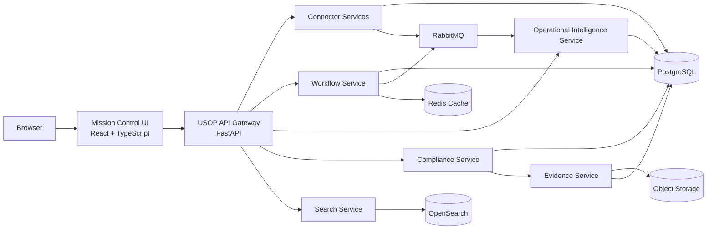

# C4 Container Architecture

Version: 0.1

Status: Draft

---

# Purpose

This document defines the major deployable components (containers) that comprise the USOP platform.

Each container represents an independently deployable service with a clearly defined responsibility.

The architecture follows the USOP Engineering Principles of:

• Single Responsibility

• Engine-First Architecture

• Modular Design

• Cloud Agnostic Deployment

---

# High-Level Container Diagram

---

# Container Responsibilities

## Mission Control UI

Purpose

User interface.

No business logic.

Displays operational intelligence.

---

## API Gateway

Purpose

Single entry point.

Authentication.

Authorization.

Routing.

API versioning.

Rate limiting.

---

## Connector Services

Purpose

Connect to external systems.

Collect operational data.

Generate synchronization events.

---

## Operational Intelligence Service

Purpose

Relationship analysis.

Change analysis.

Operational intelligence.

Event generation.

---

## Workflow Service

Purpose

Tasks.

Approvals.

Notifications.

Scheduling.

Operational Journal generation.

---

## Evidence Service

Purpose

Evidence management.

Audit package generation.

Evidence health.

Evidence freshness.

---

## Compliance Service

Purpose

Framework evaluation.

Control mapping.

Readiness scoring.

Executive reporting.

---

## Search Service

Purpose

Full-text search.

Relationship search.

Operational Journal search.

Evidence search.

---

## Shared Infrastructure

PostgreSQL

Redis

RabbitMQ

OpenSearch

Object Storage

---

# Deployment Philosophy

Each service may be deployed independently.

Each service may be horizontally scaled.

Each service communicates through APIs and events.

No service owns another service's business logic.

Shared infrastructure should be replaceable without redesigning the application.

---

# Future Containers

Identity Service

Notification Service

Reporting Service

AI Recommendation Service

Mobile API

Plugin Marketplace

Customer Administration Service
